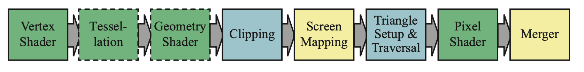

# Real Time Rendering Note # 2

## GPU简述

当数据在存取的时候，处理器处于一种等待的状态（Stall），这将极大拖慢处理的速度。CPU可以处理许多不同种类的数据类型，但是，除了SIMD结构外，CPU只能线性地进行运算。而GPU则使用大量的核心（Core）进行并行的运算，且具有大量快速寄存器，大量极有可能用到的数据也被放入缓存中。

比如，我们为每一个顶点或者像素分配一个小的寄存器，在需要读取材质这样只能存在缓存中的数据时，我们不断做Swift，即处理下一个顶点，直到从相较于寄存器更慢的缓存读取到了Texture信息。这种Swift不改变上一个处理顶点的寄存器数据，也基本不花费时间。

在这样的并行结构中，我们通过不断做SWIFT操作使得GPU的核心不停在处理片段（Fragment）。每一次像素着色器（Pixel Shader）的调用成为一个线程（Thread），这样一个线程包含了用于储存输入数据的缓存以及够其运行的寄存器。使用同一个着色器的线程被组成一束（N卡上为32个线程），称为Warp（AMD称为wavefronts）。一个Warp将被一定数量（8～64个）的核心来执行。

在执行的时候，如果需要读取内存，则一个Warp中的所有线程都会同时stall，这时候处理器直接切换下一个Warp进行处理，因为每个Warp都有自己的寄存器和缓存，因此数据不会有变化，而且效率极高。影响处理效率的主要有两条：1、因为数据量导致的Occupancy，2、分支选择（if）

如上图，一段程序（Program）被分发到一组组Warp中，当遇到txr指令，即需要及性能内存读取时，swap到另一个Warp进行处理。这样，处理器就会一直在工作。

## GPU实现渲染管线

GPU中使用硬件实现了几何处理（Geometry Processing），光栅话以及像素处理（Pixel Processing）。在GPU中，一些阶段是可编程的，而另一些阶段只能配置。上图中绿色的是可编程的，黄色的部分是可配置的，而蓝色的部分则是固定管线。

在GPU的实现中，即使在Graphics API中是连续的一段程序也可能在不同的硬件阶段进行处理。因此，当我们关注GPU程序的效率时，不能只关注逻辑语言上的效率。

几个可配置的阶段：
- Screen Mapping需要配置窗口和视窗大小
- Merger虽然使用固定管线，但是可以使用各种buffer取得不同的效果

### 可编程着色器阶段

相比于过去使用顶点处理器和片段处理器的阶段，目前的着色器更加统一，使用同样的指令集，有着相同的编程模型（Common Programming Model）。c语言风格的着色器语言有GLSL，HLSL等等。为了与平台无关，HLSL被编译为虚拟机器字节码进行储存。而在主机上，一般则不需要这样做，因为主机一般使用固定的指令集。GPU使用32bit的单精度浮点数作为基本类型，一般用于表示位置（xyzw）、法向量、矩阵行、颜色（rgba）、材质坐标等等（uvwq）。整数类型一般用于表示索引（indices），计数器和bitmask。

draw call触发GPU处理一组**图元**，而一般着色器阶段开始的输入有两种：uniform，即一次draw call中不会改变的数据（材质是一种特殊的uniform，因为数据量巨大）；而varying则是会根据上一个流程中的输出而决定。

flow control：如果条件语句只和unifrom相关，则称为静态流，其效率高于基于可变输入的条件语句的动态流。

### 着色器语言和API的进化

- 1980s shade tree / RenderMan（影视制作）
- 1996 3dfx 消费级显卡
- OpenGL 1.1
- Geforce256
- Geforce3 使用DirectX 8.0或OpenGL扩展驱动的可编程顶点着色器
- DX 9.0 HLSL
- OpenGL ES 1.0
- WebGL
- Metal
- Vulcan

## 顶点着色器

尽管顶点着色器是第一个由编程控制的阶段，其之前其实已经进行了一些处理了。这些处理主要是对图元数据进行组装（Assemble），即根据index将顶点的pos，normal，texcoord等数据进行组合，传递给顶点着色器。

一个顶点（Vertex）一般包含了位置（position），纹理坐标（texture coordinates），颜色（color）以及顶点法线（vertex normal）。这里，一个三角面其实本身就具有一个法线方向，但是顶点法线可用于对隐含曲面的描述。